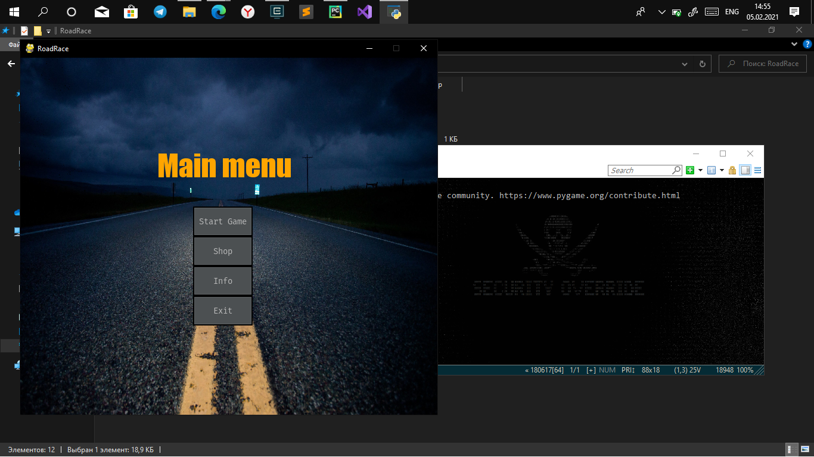
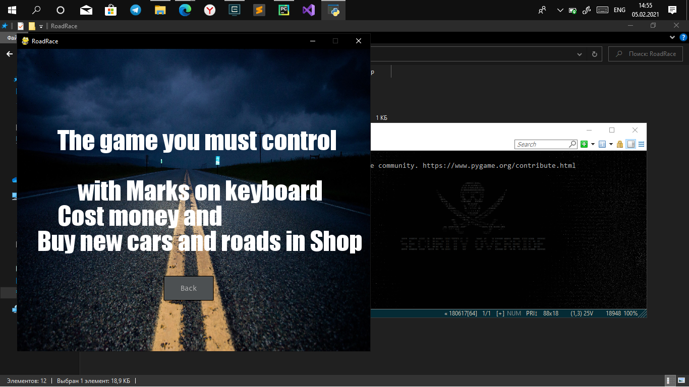
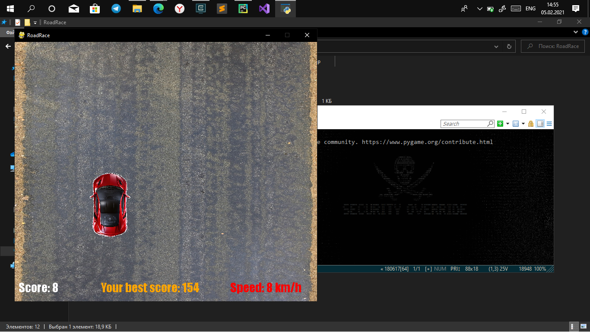
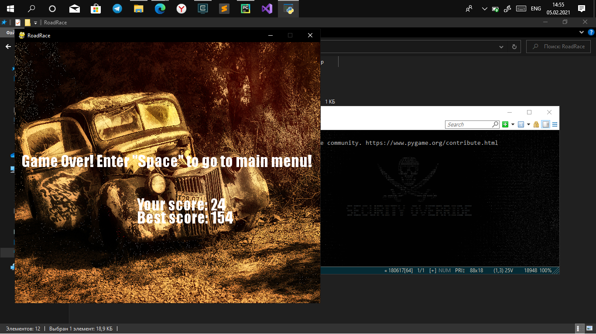
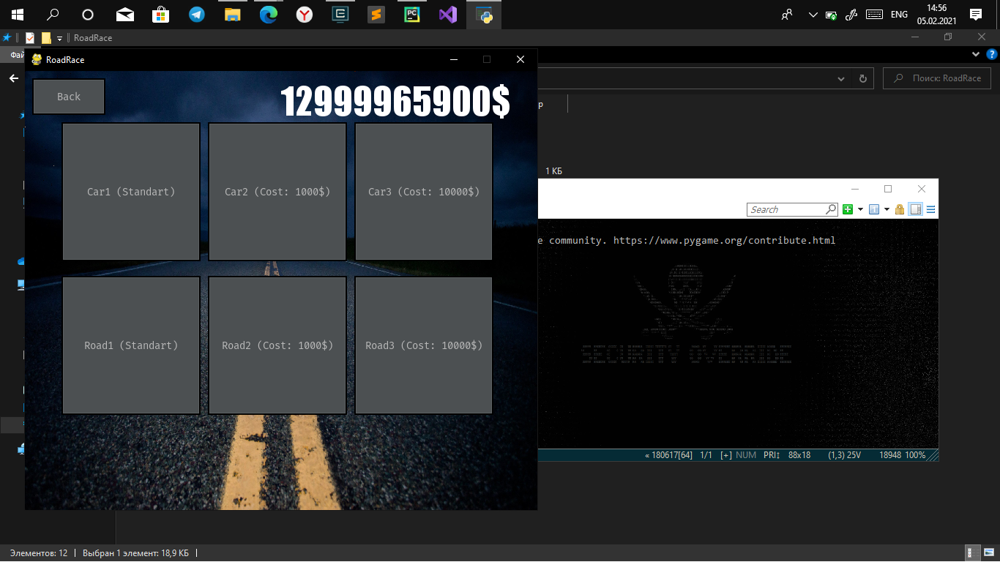

# ArcadeRacer
<h1>ArcadeRacer - это аркадная гонка написанная на Pygame</h1>

  Правила игры очень просты - необходимо управлять автомобилем так, чтобы не столкнуться с каким-нибудь препятствием.  
  Вы можете заработать деньги и купить новые трассы и автомобили

<!-- Управление -->
<h1>Управление</h1>

Управление автомобилем осуществляется с помошью стрелок на клавиатуре. 
С их помощью вы можете перемещать автомобиль влево/право. 
Чем дороже стоит автомобиль тем быстрее скорость перемещения. 

<!-- Библиотеки -->
<h1>Использованные технологии</h1>

	В игре использовались следующие библиотеки: 
	1) pygame 
	2) pygame_gui 
	3) random 
	4) sys 
	5) os 
	6) sqlite3 

<!-- Основные классы -->
<h1>Основные классы</h1>

	Игра представлена следующими основными классами: 
	1) MainMenu - сцена главного меню 
	2) Shop - сцена игрового магазина 
	3) Info - сцена с правилами игры 
	4) Game - сцена с игровым процессом 
	5) GameOver - сцена заставки окончания игры 

<!-- Изображения -->
<h1>Изображения</h1>

  
  
  
  
  

